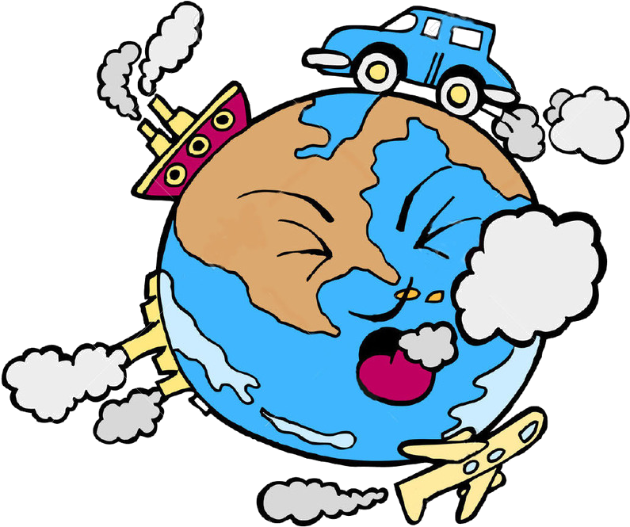
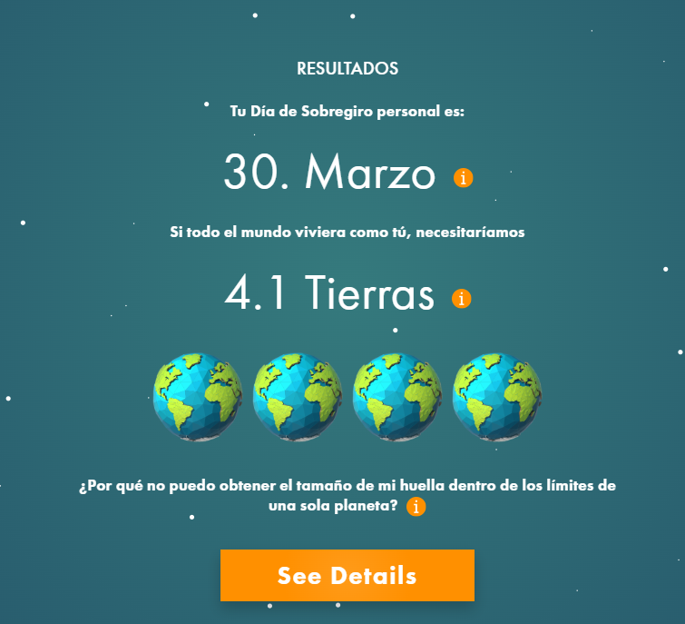
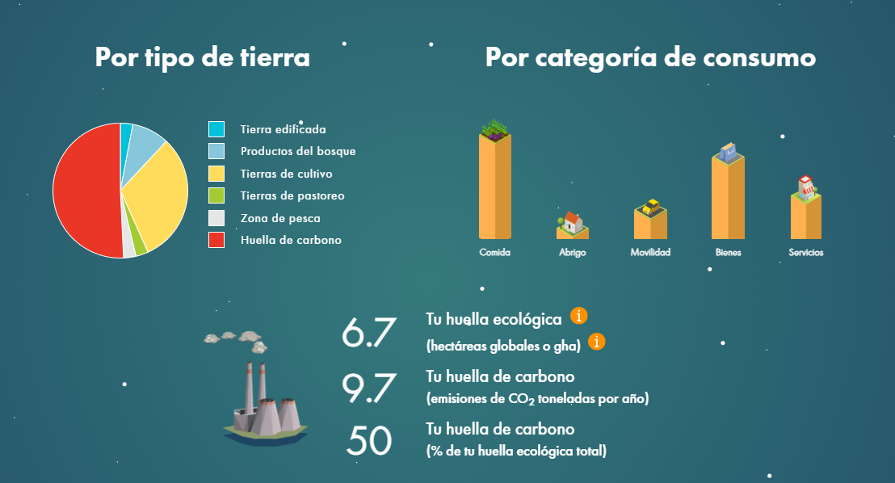
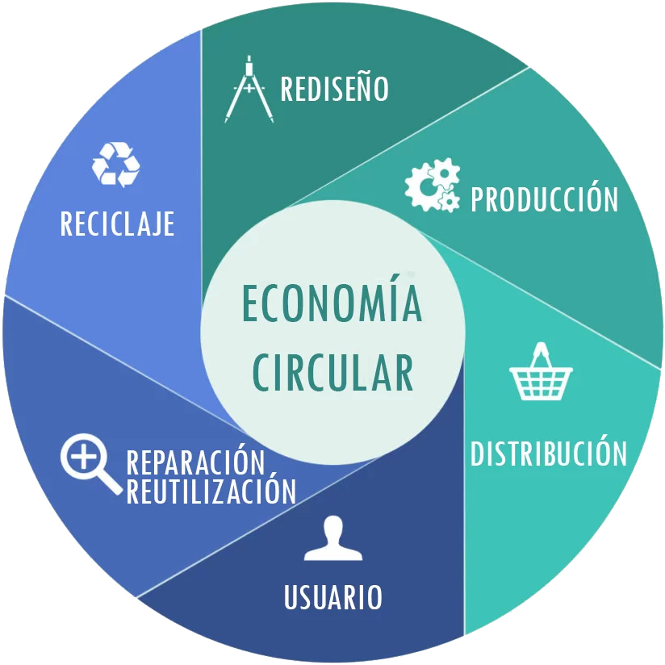
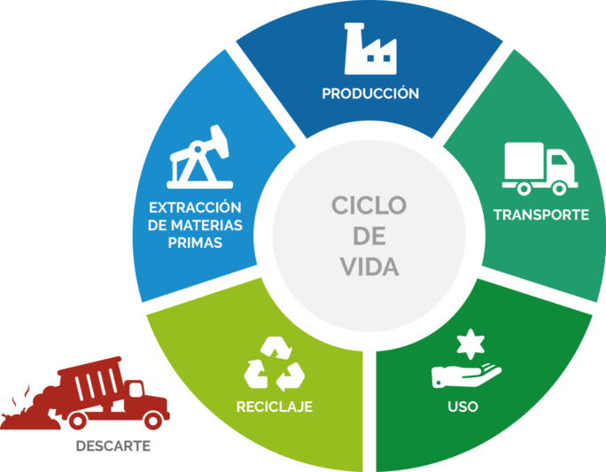

# SOSTENIBILIDAD

# DICIEMBRE

## Clase 11 | Cambio Climático

Durante la clase de hoy se ha comentado el problema del cambio climático y cómo este nos afecta como sociedad. Del mismo modo, se ha explicado cómo el Ministerio de Defensa interviene en este asunto y las complicaciones que este problema conlleva. También se han visto algunas políticas de mitigación del cambio climático.

### ¿Cuál es el principal emisor de CO₂ y qué podemos hacer en nuestro oficio para ayudar en este problema?

- La quema de combustibles fósiles como el carbón, el petróleo y el gas natural para la generación de energía y el transporte, seguida por la industria y la deforestación, son los mayores emisores de CO₂.

- Como programadores, trabajaremos en alguna empresa que necesite algún tipo de servidor o incluso varios de estos. Una forma de minimizar los desechos que podemos producir y ayudar a mitigar el cambio climático sería hacer uso de componentes antiguos para crear o reparar los servidores de la empresa.

## Clase 10 | Huella ecológico y huella de carbono

Durante la clase de hoy se ha explicado lo que es la huella de carbono, que mide la cantidad de gases de efecto invernadero que genera una persona, empresa o actividad, y la huella ecológica que mide cuánta naturaleza (recursos) se necesita para sostener el estilo de vida de alguien o de una comunidad.

### ¿Cual es nuestra huella de carbono?

Como se ve en las imagenes mi huella de carbono y ecológica es algo elevada, no obastante y a pesar de que ciertos aspectos se podrian mejorar, se valoran algunas cosas en el cuestionario que afectan inevitablemente al resultado de forma negativa, como el transporte público, que en jumilla escasea bastante, asi como si la energia que consumo es renovable pudiendo venir esta de placas solares o si los alimentos que consumo son no envasados, no procesados o locales. Estos ultimos factores dependen bastante del poder económico de la persona y no son culpa directa del individuo.

# NOVIEMBRE

## Clase 9 | Economia Circular

Durante la clase de hoy, se ha mostrado el tema de la economía circular, una economía que por decirlo de algún modo se retroalimenta, con los desechos que se producen se genera un negocio y este desecho vuelve como materia prima para crear más cosas. Se ha usado para explicar esto el ejemplo de como un coche va al desguace, de el sale chatarra y esta chatarra es fundida para usar el metal y crear más coches.

### Pregunta: ¿En que nos afecta el ecodiseño?

- Nos afecta en la creación de empleo, con este tipo de economía se genera empleo que se encarga en los procesos de la reutilización de los desechos

## Clase 8 | El viaje oculto del producto

Durante la clase de hoy se ha planteado el gasto de materiales usados en la creacion de un telefono movil, visto en kilogramos, viendo que para crear un movil de 150 gramos se necesitan 80 kilogramos de materiales, asi como las energias que se pueden usar para la creación del mismo

### Analisis de ciclo de vida (paso de fabricación)

- Según ALBOAN / Tecnología Libre de Conflicto, para producir un solo smartphone se utilizan 44,4 kg de recursos naturales (materias primas). 

- Esa cifra de 44,4 kg incluye la llamada “mochila ecológica”: es decir, todo el uso de materiales desde la extracción, procesamiento, transporte, etc. 

- De esos 44,4 kg, según ese mismo modelo, 6 kg son solo usados para producción o fabricación del telefono movil

# OCTUBRE

## CLASE 6

### Estrategia K y R

- Durante la clase de hoy 24/10/2025, en clase hemos estado analizando las estrategias K y R, en equilibrio y oportunista, estas estrategias
describen la forma de reproducción de las especies, la estrategia r se basa en una reproducción rápida y masiva pero con una esperanzas de vida mas limitadas,
mientras que la estrategia k consiste en un reproducción más lenta pero con una esperanza de vida mucho mas larga. 

### ¿Que estrategia seguimos los humanos?

- Los humanos a pesar de que historicamente han seguido en diversas situaciones una estrategia R, en la actualidad usamos una estrategia K, ya que 
buscamos una esperanza de vida mas larga.

## CLASE 5

### ¿Vivimos solos?

- Durante la clase del viernes 17/10/2025 se ha planteado la cuestion de si vivimos solos, a lo que se ha respondido que obviamente no
  vivimos en familia, con otras especie, en familia, en sociedad en general, el vivir en sociedad hace que tengamos que modificar 
  ciertos comportamientos y adecuarnos para la vida en sociedad, de esto mismo surge la cooperación y competitividad.

### ¿Que hacemos nosotros cooperamos o competimos?

- Cooperamos o competimos segun el ambito y la situación en la que nos encontremos, en una situacion laboral competimos y 
  cooperamos, podemos competir contra otro equipo de desarrollo para sacar mejor resultado que ellos y a la vez cooperar con nuestros 
  compañeros para obtener es resultado mejor, de modo que no se realiza ni solo una ni solo la otra, sino ambas, a veces a la vez, a veces en 
  distintos momentos

## CLASE 4

### Límite de carga en los ecosistemas

- Durante la clase de hoy se ha planteado mediante un ejemplo de un trozo de pan con moho
  como todas las especies se expanden hasta lleguar a un límite, sea por falta de recursos u otros motivos,
  al llegar a dicho límite se intenta sobrepasar y con ello surgen conflictos.

#### Pregunta : ¿Hay un límite para la población humana?

- Si que lo hay, debido a según se ha visto mediante una gráfica se llega a un punto en el que se estanca y
  no continua el crecimiento de la población

# SEPTIEMBRE
## CLASE 1
### Introducción a la asignatura

- En esta primera clase se nos ha explicado y planteado la dinámica y funcionamiento de la asignatura.

## CLASE 2
### ¿Qué es la sostenibilidad?

- En esta segunda clase hemos estado explorando el término de sostenibilidad, empezando por su 
significado tradicional hasta cómo se ha adaptado en la actualidad, así como también se ha visto 
la diferencia entre ecologismo y ecología.

## CLASE 3
### ¿Somos animales?

- Durante la clase de hoy se ha planteado la cuestión de si el ser humano es un animal, 
añadiendo ciertos argumentos para demostrarlo o desmentirlo, concluyendo que el ser humano es un animal 
a pesar de tener una conciencia más compleja y un poder de razonamiento superior.

#### ¿Acabaremos con la vide en nuestro planeta?

- Acabar con la vida en el planeta es algo práctimente imposibile debido a la gran diversidad del planeta, 
ya que ciertas especies serían capaces de sobrevivir en situciones extremas. No obstante sí que es totalmente
posible con casi toda vida humana y animal existente en el planeta.

